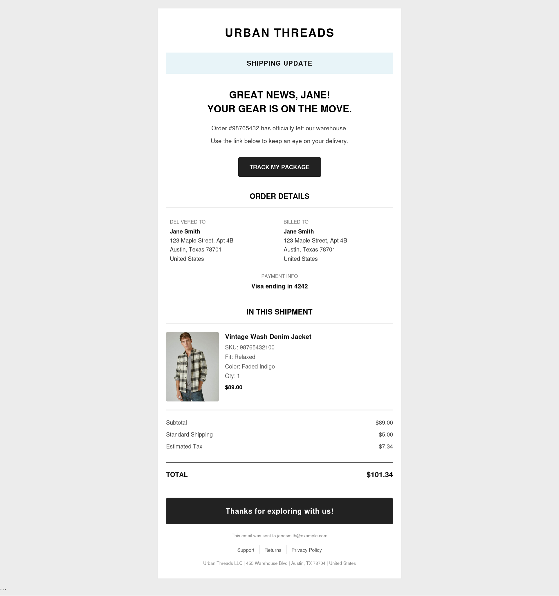
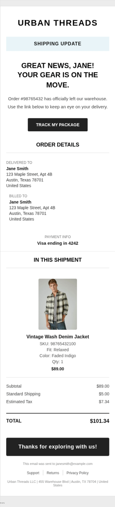

# 📦 Dynamic E-Commerce Transactional Shipping System
### A Responsive HTML Email Template with Integrated Liquid Logic

| Desktop Preview | Mobile Preview |
| :--- | :--- |
|  |  |

## 📖 Project Overview
Email development requires a specialized approach compared to traditional web development. While modern browsers support advanced CSS, many email clients rely on legacy rendering engines that often break standard layouts.

This repository showcases a **production-ready Transactional Shipping Update template**, specifically engineered for high-volume e-commerce. It utilizes a robust hybrid-fluid architecture and **Liquid templating logic** to ensure a premium, personalized brand experience across all platforms.

## 🛠️ Technical Implementation
To achieve maximum reliability and visual consistency, I implemented the following professional development standards:

* **Dynamic Data Rendering (Liquid):** Engineered a `` loop that programmatically generates product rows. This allows the email to scale automatically from a single-item shipment to complex, multi-item orders without manual coding.
* **Conditional Logic & Data Safety:** Implemented strict `` statements to handle data edge cases—such as toggling between "Free Shipping" and currency values, and protecting payment information rows to prevent layout breaks if data is missing.
* **Bulletproof Hybrid Architecture:** Built using a table-based, fluid-hybrid layout with strict `max-width` properties and `inline-block` containers. This ensures 1-to-1 visual parity between desktop and mobile clients without relying on complex media queries.
* **Outlook-Safe Spacing & Fluid Alignment:** Replaced standard CSS margins with strict padding and utilized a `font-size: 0;` wrapper technique to eliminate phantom rendering gaps in legacy Microsoft Word rendering engines.
* **Accessibility & Performance:** Applied `role="presentation"` to all layout tables for screen reader optimization and used meticulously inlined CSS to bypass restrictive style-stripping in clients like Gmail.

## 🚀 Platform Integration
The code is modular and "ESP-Ready," making it perfectly suited for immediate integration into major Marketing Automation and CRM platforms, including:
* **Salesforce Marketing Cloud (AMPscript/Liquid compatible)**
* **Mailchimp**
* **Klaviyo**
* **Shopify / HubSpot**

## 📂 Repository Structure
* `index.html`: The core production-ready template containing Liquid logic.
* `render.js`: A Node.js script using `liquidjs` to simulate ESP rendering.
* `preview.jpg`: Visual representation of the rendered desktop layout.
* `preview-mobile.jpg`: Visual representation of the rendered mobile layout.

## 🤝 Contact
**Salah Attar** *Web & Email Developer* Focused on creating high-conversion, accessible, and technically robust digital experiences.
